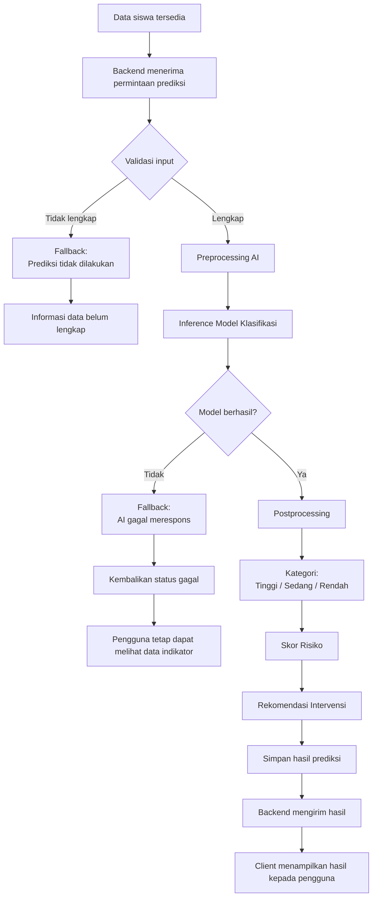
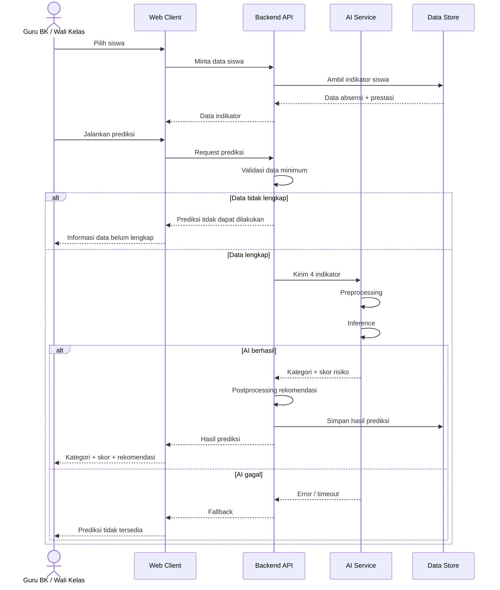

# DRAFT High-Level Design (HLD) DisiplinGuard

Dokumen ini diturunkan dari PRD, SRS, User Story, dan Acceptance Criteria yang diberikan. Fokus arsitektur berada pada kebutuhan **deteksi dini kedisiplinan berbasis AI**, sedangkan detail class, method, query, dan implementasi tingkat rendah tidak dibahas.

## 1. Diagram Arsitektur

### 1.1 Arsitektur Logical

```mermaid
flowchart LR
    U[Guru BK / Wali Kelas]

    C[Web Browser<br/>Desktop / Smartphone]

    B[Backend API<br/>Manajemen Data & Business Logic]

    A[AI Service<br/>Klasifikasi Kedisiplinan]

    D[(Data Store<br/>Data Siswa, Absensi,<br/>Nilai & Hasil Prediksi)]

    E[External Service<br/>Opsional / [ASUMSI-09]]

    U --> C
    C -->|HTTPS| B
    B -->|Data indikator siswa| A
    A -->|Prediksi + skor risiko| B
    B --> D
    B -->|Hasil rekomendasi| C

    B -.-> E
```

### 1.2 Komponen Utama

| Komponen             | Peran               | Tanggung Jawab                                                                                                                 | Teknologi Usulan                                              |
| -------------------- | ------------------- | ------------------------------------------------------------------------------------------------------------------------------ | ------------------------------------------------------------- |
| **Client Web**       | Antarmuka pengguna  | Menampilkan dashboard, daftar prioritas, data siswa, hasil AI, dan rekomendasi                                                 | HTML/CSS/JavaScript atau framework web ringan **[ASUMSI-01]** |
| **Backend API**      | Orkestrasi aplikasi | Mengelola permintaan pengguna, validasi data, komunikasi dengan AI Service, penyimpanan hasil, dan kontrol akses               | **Laravel 12 [ASUMSI-02]**                                    |
| **AI Service**       | Prediksi            | Melakukan preprocessing yang diperlukan, inference model klasifikasi, dan menghasilkan kategori kedisiplinan serta skor risiko | **Python + scikit-learn [ASUMSI-03]**                         |
| **Data Store**       | Penyimpanan data    | Menyimpan data siswa, indikator absensi/prestasi, dan hasil prediksi yang diperlukan sistem                                    | **MySQL [ASUMSI-04]**                                         |
| **External Service** | Layanan tambahan    | Tidak menjadi komponen wajib prototype                                                                                         | **Tidak digunakan pada MVP [ASUMSI-09]**                      |

### 1.3 Keputusan Arsitektur

Arsitektur memisahkan **Backend API** dan **AI Service** agar fungsi aplikasi dan fungsi prediksi memiliki tanggung jawab yang jelas. Pemisahan ini juga memungkinkan model klasifikasi dikembangkan dan dievaluasi tanpa menjadikan logika prediksi sebagai bagian dari antarmuka pengguna.

Untuk prototype satu semester, komponen dibuat seminimal mungkin. Tidak diperlukan layanan eksternal tambahan kecuali terdapat kebutuhan yang belum disebutkan dalam PRD atau SRS.

---

# 2. Keputusan Penempatan Model AI

Tiga alternatif utama dipertimbangkan untuk menjalankan model AI.

| Alternatif                          | Akurasi                         | Latensi             | Biaya                     | Privasi                                         | Effort        |
| ----------------------------------- | ------------------------------- | ------------------- | ------------------------- | ----------------------------------------------- | ------------- |
| **Cloud AI API**                    | Bergantung layanan eksternal    | Bergantung jaringan | Sedang–tinggi             | Lebih kompleks karena data siswa dikirim keluar | Rendah–sedang |
| **AI service lokal/server sekolah** | Mengikuti model hasil riset     | Berpotensi rendah   | Rendah                    | Lebih mudah dikendalikan                        | Sedang        |
| **On-device di browser/smartphone** | Bergantung kompatibilitas model | Berpotensi rendah   | Rendah setelah distribusi | Tinggi karena data dapat diproses lokal         | Tinggi        |

### Rekomendasi: AI Service Lokal

**Rekomendasi arsitektural:** model ditempatkan pada **AI Service lokal/server yang berada dalam lingkungan aplikasi**.

Alasannya, DisiplinGuard memiliki kebutuhan biaya komputasi rendah dan data yang diproses merupakan data siswa. Penempatan lokal menghindari ketergantungan terhadap API AI eksternal dan mengurangi kebutuhan mengirim data siswa ke pihak ketiga.

**Alternatif:** *on-device* dapat mengurangi komunikasi ke server, tetapi effort pengembangan dan kompatibilitas model lebih tinggi untuk prototype satu semester.

> Pilihan teknologi dan pola deployment pada bagian ini merupakan **[ASUMSI-01 sampai ASUMSI-04]**, karena PRD/SRS hanya menetapkan platform, model ringan, biaya rendah, dan kebutuhan privasi, bukan framework atau database tertentu.

---

# 3. Arsitektur Fitur AI

## 3.1 Input AI

Data minimum yang masuk ke proses prediksi:

```text
Persentase Kehadiran
Jumlah Alfa
Jumlah Keterlambatan
Prestasi Akademik / Rata-rata Nilai
```

Data tersebut merupakan empat indikator yang ditetapkan sebagai input minimum fitur AI.

## 3.2 Aliran Data End-to-End



## 3.3 Tahapan Proses

### A. Validasi

Backend memastikan empat data minimum tersedia sebelum meminta prediksi.

Jika salah satu data tidak tersedia:

**Input tidak lengkap → prediksi tidak dijalankan → pengguna memperoleh informasi data belum lengkap.**

### B. Preprocessing

AI Service menyiapkan empat indikator dalam bentuk yang sesuai dengan model yang digunakan.

Detail transformasi, encoding, normalisasi, dan metode teknis lainnya belum ditentukan pada SRS sehingga ditandai:

**[ASUMSI-05]** Bentuk preprocessing mengikuti kebutuhan model yang dipilih berdasarkan eksperimen sebelumnya.

### C. Inference

AI Service menjalankan model klasifikasi yang telah dievaluasi sebelumnya.

Model yang pernah diuji:

* Decision Tree
* KNN
* Naive Bayes

Hasil penelitian menunjukkan akurasi terbaik **77,62% menggunakan Naive Bayes**.

Pemilihan final model untuk prototype:

**[ASUMSI-06] Naive Bayes digunakan sebagai baseline model prototype karena memiliki akurasi terbaik pada hasil pengujian yang tersedia.**

### D. Postprocessing

Hasil inference diterjemahkan menjadi:

```text
Kategori Kedisiplinan
+
Skor Risiko
+
Rekomendasi Intervensi
```

### E. Penyimpanan

Hasil prediksi disimpan agar dapat digunakan oleh fungsi pemantauan dan daftar prioritas.

### F. Fallback

Terdapat dua kondisi utama:

```text
Data tidak lengkap
        ↓
Prediksi tidak dijalankan

AI gagal / tidak merespons
        ↓
Prediksi tidak dianggap valid
        ↓
Data siswa tetap dapat dipantau secara manual
```

Sistem **tidak boleh membuat hasil prediksi pengganti ketika AI gagal**.

---

# 4. Kontrak Antarkomponen Tingkat Tinggi

## 4.1 API Utama

### API-01 — Meminta Prediksi Kedisiplinan

**Pemicu:** Guru BK/Wali Kelas menjalankan prediksi untuk seorang siswa.

**Input tingkat tinggi:**

```json
{
  "student_id": "S001",
  "attendance_percentage": 92.5,
  "alpha_count": 2,
  "late_count": 3,
  "average_score": 84.0
}
```

**Output sukses:**

```json
{
  "student_id": "S001",
  "discipline_category": "sedang",
  "risk_score": 0.68,
  "recommendation": "Tindak lanjut pembinaan dan pemantauan berkala"
}
```

Struktur field di atas adalah **format usulan tingkat tinggi [ASUMSI-07]**, bukan kontrak API final dari SRS.

---

## 4.2 API-02 — Mengambil Daftar Prioritas Siswa Berisiko

**Pemicu:** Guru membuka daftar prioritas.

**Output tingkat tinggi:**

```json
{
  "students": [
    {
      "student_id": "S001",
      "discipline_category": "rendah",
      "risk_score": 0.82
    }
  ]
}
```

Tujuannya mendukung FR-10, yaitu menampilkan siswa yang perlu ditindaklanjuti.

---

## 4.3 API-03 — Mengambil Detail Siswa

**Pemicu:** Pengguna memilih siswa.

Output minimal memuat indikator yang diperlukan untuk pemantauan:

```json
{
  "student_id": "S001",
  "attendance_percentage": 92.5,
  "alpha_count": 2,
  "late_count": 3,
  "average_score": 84.0
}
```

---

## 4.4 Event Tingkat Tinggi

Tidak diperlukan event eksternal yang kompleks untuk MVP.

Alur utama cukup berbasis permintaan:

```text
User Action
    ↓
Backend API
    ↓
AI Service
    ↓
Backend API
    ↓
Data Store
    ↓
Client
```

Notifikasi otomatis merupakan fitur **Could Have**, sehingga tidak menjadi bagian arsitektur MVP.

---

# 5. Security & Privacy by Design

Data yang diproses mencakup data siswa, absensi, prestasi akademik, dan hasil prediksi. Karena itu, keamanan dan privasi harus ditempatkan sebagai bagian dari desain, bukan tambahan setelah implementasi.

## 5.1 Authentication

**Usulan:**

```text
User
 ↓
Authentication
 ↓
Backend API
 ↓
Data / AI
```

Akses sistem dibatasi kepada pengguna yang memiliki hak akses.

**[ASUMSI-10]** Mekanisme autentikasi spesifik, seperti session atau token, belum ditentukan dalam SRS.

## 5.2 Authorization

Hak akses harus dikendalikan berdasarkan kebutuhan pengguna agar tidak semua pengguna dapat mengakses seluruh data siswa.

Detail matriks hak akses:

**[ASUMSI-11] Belum ditentukan dalam PRD/SRS.**

## 5.3 Enkripsi

| Area                 | Perlindungan                                      |
| -------------------- | ------------------------------------------------- |
| Client → Backend     | HTTPS/TLS                                         |
| Backend → AI Service | Kanal komunikasi terlindungi **[ASUMSI-12]**      |
| Penyimpanan data     | Perlindungan akses terhadap database              |
| Backup               | **[ASUMSI-13]** Mekanisme backup belum ditentukan |

## 5.4 Data Sensitif

Data siswa harus diperlakukan sebagai data sensitif dalam konteks aplikasi.

Prinsip yang digunakan:

* data hanya digunakan untuk fungsi DisiplinGuard
* akses data dibatasi kepada pengguna yang berwenang
* hasil prediksi tidak diposisikan sebagai diagnosis pasti
* hasil AI tidak digunakan untuk menetapkan hukuman otomatis

Prinsip tersebut konsisten dengan BR-07 sampai BR-10.

## 5.5 Logging

Logging diperlukan untuk membantu pemeriksaan sistem, tetapi isi log tidak boleh menjadikan seluruh data siswa terekspos.

**[ASUMSI-14]** Detail field logging, retensi log, dan mekanisme audit belum ditetapkan pada SRS.

---

# 6. Lingkungan Deployment

## 6.1 Development

Digunakan oleh tim pengembang untuk membangun dan menguji prototype.

```text
Developer
   ↓
Web Client
   ↓
Backend API
   ↓
AI Service
   ↓
Database
```

Data pengujian sebaiknya menggunakan dataset yang disediakan untuk penelitian/prototype.

## 6.2 Staging

Digunakan untuk melakukan pengujian integrasi dan UAT sebelum digunakan dalam lingkungan sekolah.

```text
Test User
   ↓
Staging Web
   ↓
Staging Backend
   ↓
Staging AI Service
   ↓
Staging Database
```

## 6.3 Production

Lingkungan penggunaan sekolah.

```text
Guru BK / Wali Kelas
        ↓
Browser
        ↓
Production Backend
        ↓
AI Service
        ↓
Production Database
```

Untuk prototype satu semester, lingkungan **staging dan production dapat dibuat sederhana** agar effort dan biaya tetap rendah.

---

# 7. Alur Operasional Fitur AI



Target waktu yang digunakan adalah:

**Latensi prediksi ≤ 3 detik [ASUMSI-07].**

Target akurasi:

**Akurasi model ≥ 77%.**

Target tersebut merupakan NFR yang sudah ditetapkan dalam SRS, sedangkan angka latensi masih berstatus asumsi.

---

# 8. Pemetaan Komponen terhadap Kebutuhan

| Komponen          | FR/NFR yang Didukung                                                 |
| ----------------- | -------------------------------------------------------------------- |
| Web Client        | FR-01, FR-02, FR-03, FR-04, FR-05, FR-06, FR-08, FR-09, FR-10, FR-14 |
| Backend API       | FR-01 s.d. FR-14, terutama orkestrasi fungsi dan akses data          |
| AI Service        | **FR-07, FR-08, FR-09, NFR-01, NFR-02, NFR-03**                      |
| Data Store        | FR-02 s.d. FR-06, FR-10, FR-13                                       |
| Security Layer    | NFR-08, NFR-09                                                       |
| Responsive Client | NFR-04                                                               |
| Evaluasi Model    | NFR-01, NFR-02                                                       |
| Latency Control   | NFR-03                                                               |
| Rekomendasi       | FR-09, NFR-11                                                        |

---

# 9. Keputusan Arsitektur Utama

| Keputusan           | Pilihan                               | Alasan                                                                                  | Alternatif                        |
| ------------------- | ------------------------------------- | --------------------------------------------------------------------------------------- | --------------------------------- |
| Penempatan AI       | **AI Service lokal**                  | Biaya rendah, lebih mudah menjaga privasi data siswa, dan sesuai kebutuhan model ringan | Cloud AI API, on-device           |
| Model baseline      | **Naive Bayes [ASUMSI-06]**           | Memiliki akurasi terbaik yang tersedia, yaitu 77,62%                                    | Decision Tree, KNN                |
| Database            | **MySQL [ASUMSI-04]**                 | Cocok untuk penyimpanan data terstruktur dan prototype sekolah                          | Database relasional lain          |
| Backend             | **Laravel 12 [ASUMSI-02]**            | Cocok sebagai backend API untuk prototype web                                           | Framework backend lain            |
| AI runtime          | **Python + scikit-learn [ASUMSI-03]** | Selaras dengan model klasifikasi yang diuji dan ringan untuk prototype                  | Runtime AI lain                   |
| Integrasi eksternal | **Tidak digunakan pada MVP**          | PRD meminta integrasi existing seminimal mungkin                                        | Integrasi absensi/nilai eksternal |

---

# 10. Batasan dan Asumsi Arsitektur

| Kode            | Batasan / Asumsi                                                             |
| --------------- | ---------------------------------------------------------------------------- |
| **[ASUMSI-01]** | Teknologi client web belum ditentukan                                        |
| **[ASUMSI-02]** | Laravel 12 dipilih sebagai backend prototype                                 |
| **[ASUMSI-03]** | Python + scikit-learn digunakan sebagai runtime AI                           |
| **[ASUMSI-04]** | MySQL digunakan sebagai data store                                           |
| **[ASUMSI-05]** | Preprocessing mengikuti kebutuhan model final                                |
| **[ASUMSI-06]** | Naive Bayes menjadi baseline model berdasarkan akurasi terbaik yang tersedia |
| **[ASUMSI-07]** | Latensi prediksi ditargetkan ≤ 3 detik sesuai SRS                            |
| **[ASUMSI-08]** | Format kontrak API pada HLD merupakan format usulan                          |
| **[ASUMSI-09]** | Tidak ada layanan eksternal yang wajib untuk MVP                             |
| **[ASUMSI-10]** | Mekanisme authentication belum ditentukan                                    |
| **[ASUMSI-11]** | Matriks otorisasi per role belum ditentukan                                  |
| **[ASUMSI-12]** | Komunikasi antarkomponen menggunakan kanal terlindungi                       |
| **[ASUMSI-13]** | Kebijakan backup belum ditentukan                                            |
| **[ASUMSI-14]** | Kebijakan detail logging dan retensi belum ditentukan                        |

---

# 11. Ringkasan Arsitektur MVP

Arsitektur MVP DisiplinGuard dapat diringkas sebagai:

```text
┌───────────────────────────────┐
│ Guru BK / Wali Kelas          │
└──────────────┬────────────────┘
               │
               ▼
┌───────────────────────────────┐
│ Web Client Responsive         │
└──────────────┬────────────────┘
               │ HTTPS
               ▼
┌───────────────────────────────┐
│ Backend API                   │
│ - Validasi                    │
│ - Business Logic              │
│ - Access Control              │
│ - Orkestrasi AI               │
└───────┬───────────────┬───────┘
        │               │
        ▼               ▼
┌───────────────┐   ┌────────────────┐
│ Data Store    │   │ AI Service     │
│ MySQL         │   │ Klasifikasi    │
│               │   │ Naive Bayes*   │
└───────────────┘   └───────┬────────┘
                            │
                            ▼
                   Kategori + Skor Risiko
                            │
                            ▼
                    Rekomendasi Intervensi

**Inti desainnya:** aplikasi web menangani interaksi dan data, Backend API menjadi pengendali alur, AI Service menangani klasifikasi, dan Data Store menyimpan informasi yang diperlukan. Ketika data AI lengkap, sistem melakukan prediksi. Ketika data tidak lengkap atau model gagal, sistem kembali ke **fallback tanpa mengarang hasil prediksi**.

Arsitektur tersebut mempertahankan batas produk yang sudah ditetapkan, yakni **satu fitur AI inti untuk klasifikasi kedisiplinan, model ringan, biaya rendah, integrasi existing seminimal mungkin, dan keputusan akhir tetap berada pada Guru BK atau Wali Kelas**.
