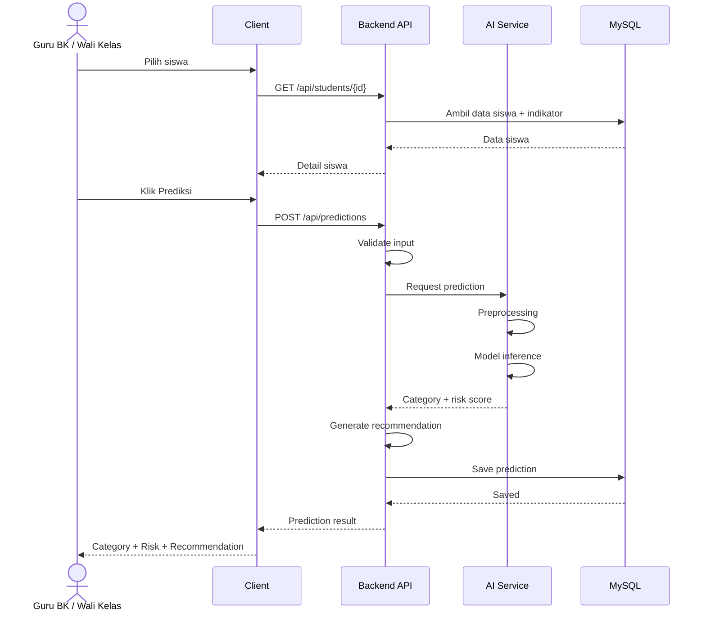
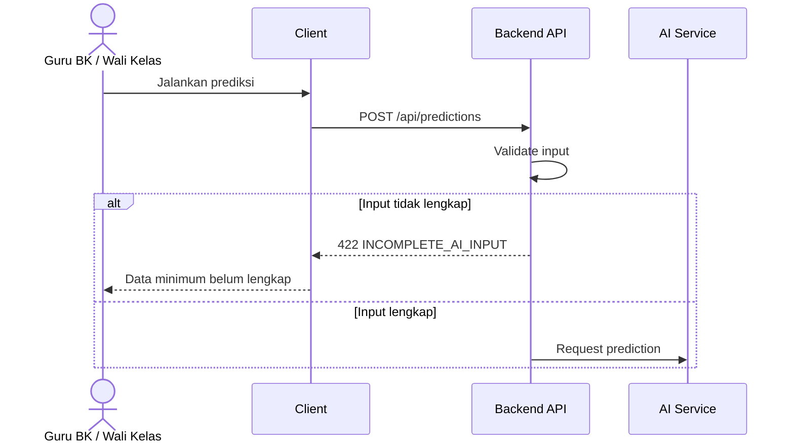
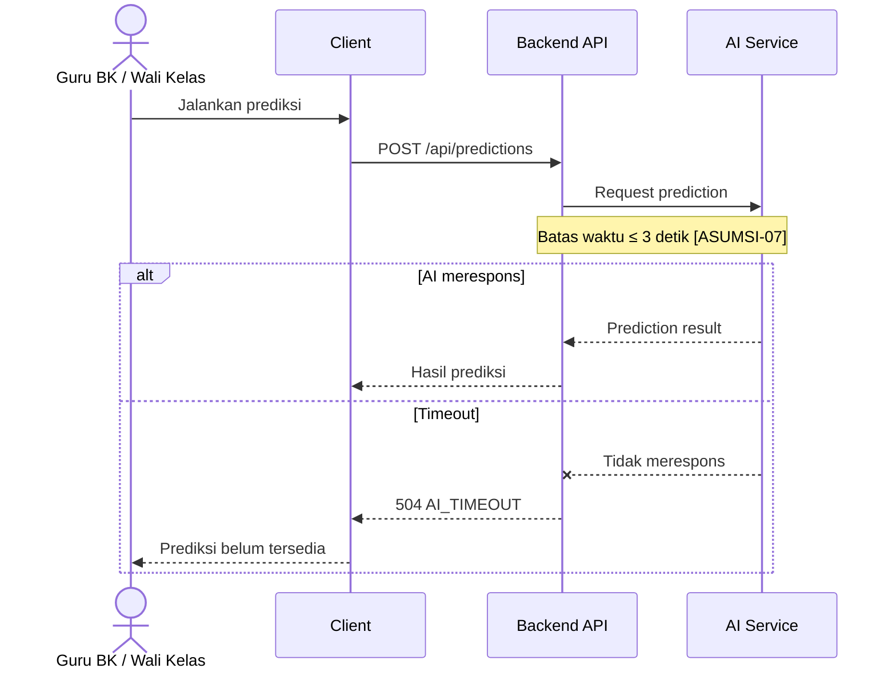

# DRAFT LLD DisiplinGuard

LLD berikut merupakan penjabaran implementatif dari SRS dan HLD terakhir. Requirement inti tidak diubah. Detail yang belum ditetapkan pada HLD diberi tanda **[KEPUTUSAN TIM: ...]** agar dapat diputuskan sebelum coding dimulai.

---

# 1. Desain Modul/Class

## 1.1 Modul Pemantauan Siswa

Modul ini menangani kebutuhan data siswa, absensi, prestasi akademik, dan ringkasan yang menjadi input fitur AI.

### Class utama

| Class                      | Tanggung Jawab                                  | Atribut Kunci                                                     | Method Utama                                                               |
| -------------------------- | ----------------------------------------------- | ----------------------------------------------------------------- | -------------------------------------------------------------------------- |
| `Student`                  | Merepresentasikan data dasar siswa              | `id`, `studentCode`, `name`, `className`, `major`                 | `getProfile()`                                                             |
| `StudentMonitoringService` | Mengambil data siswa dan indikator kedisiplinan | `studentRepository`, `attendanceRepository`, `academicRepository` | `getStudentDetail()`, `getAttendanceIndicator()`, `getAcademicIndicator()` |
| `StudentRepository`        | Mengambil data siswa dari Data Store            | `dbConnection`                                                    | `findById()`, `findAll()`                                                  |
| `AttendanceRepository`     | Mengambil indikator absensi                     | `dbConnection`                                                    | `findByStudentId()`                                                        |
| `AcademicRepository`       | Mengambil prestasi akademik                     | `dbConnection`                                                    | `findByStudentId()`                                                        |

### Tanggung jawab alur

```text
Client
  ↓
StudentMonitoringController
  ↓
StudentMonitoringService
  ├── StudentRepository
  ├── AttendanceRepository
  └── AcademicRepository
  ↓
Response
```

Modul ini mendukung **FR-02 sampai FR-06**.

---

# 1.2 Modul Daftar Prioritas Siswa Berisiko

Modul ini digunakan untuk menampilkan siswa yang telah memiliki hasil prediksi dan membantu Guru BK/Wali Kelas menentukan prioritas pemantauan.

| Class                  | Tanggung Jawab                               | Atribut Kunci                                                 | Method Utama                                    |
| ---------------------- | -------------------------------------------- | ------------------------------------------------------------- | ----------------------------------------------- |
| `RiskPriorityService`  | Mengambil dan menyusun daftar siswa berisiko | `predictionRepository`, `studentRepository`                   | `getRiskPriorityList()`                         |
| `PredictionRepository` | Mengambil hasil prediksi tersimpan           | `dbConnection`                                                | `findLatestByStudentId()`, `findRiskStudents()` |
| `RiskPriorityDTO`      | Membentuk data yang dikirim ke client        | `studentId`, `studentName`, `disciplineCategory`, `riskScore` | `toArray()`                                     |

### Alur

```text
Client
  ↓
RiskPriorityController
  ↓
RiskPriorityService
  ↓
PredictionRepository
  ↓
Data Store
  ↓
RiskPriorityDTO
  ↓
Client
```

Modul mendukung **FR-01 dan FR-10**, dengan dashboard menggunakan data agregat dari hasil pemantauan.

---

# 1.3 Modul Prediksi Kedisiplinan ★

Ini merupakan modul paling penting karena menangani **FR-07, FR-08, dan FR-09**.

| Class                         | Tanggung Jawab                                           | Atribut Kunci                                                                                | Method Utama  |
| ----------------------------- | -------------------------------------------------------- | -------------------------------------------------------------------------------------------- | ------------- |
| `DisciplinePredictionService` | Mengorkestrasi proses prediksi                           | `validator`, `aiClient`, `riskScoreService`, `recommendationService`, `predictionRepository` | `predict()`   |
| `PredictionInputDTO`          | Membawa empat input minimum AI                           | `studentId`, `attendancePercentage`, `alphaCount`, `lateCount`, `averageScore`               | `toArray()`   |
| `PredictionResultDTO`         | Membawa hasil AI                                         | `disciplineCategory`, `riskScore`, `recommendation`                                          | `toArray()`   |
| `PredictionValidator`         | Memvalidasi input sebelum dikirim ke AI                  | `rules`                                                                                      | `validate()`  |
| `AIClient`                    | Berkomunikasi dengan AI Service                          | `baseUrl`, `timeout`                                                                         | `predict()`   |
| `RiskScoreService`            | Mengolah representasi risiko dari hasil model            | `mappingRule`                                                                                | `calculate()` |
| `RecommendationService`       | Menentukan rekomendasi berdasarkan hasil risiko/kategori | `recommendationRule`                                                                         | `generate()`  |
| `PredictionRepository`        | Menyimpan hasil prediksi                                 | `dbConnection`                                                                               | `save()`      |

### Struktur tanggung jawab

```text
DisciplinePredictionController
             │
             ▼
DisciplinePredictionService
     ┌───────┼────────┬───────────────┐
     ▼       ▼        ▼               ▼
Validator  AIClient  RiskScore     Recommendation
                       Service          Service
                          │               │
                          └───────┬───────┘
                                  ▼
                         PredictionRepository
                                  │
                                  ▼
                              MySQL
```

### Method utama

```text
predict(PredictionInputDTO input)

1. validate(input)
2. jika invalid → ValidationError
3. kirim input ke AI Service
4. jika timeout/error → fallback
5. terima disciplineCategory
6. hitung/normalisasi riskScore
7. generate recommendation
8. simpan hasil
9. kembalikan PredictionResultDTO
```

---

# 1.4 Pilihan Library AI

HLD menetapkan **Python + scikit-learn** dan baseline **Naive Bayes**, tetapi jenis implementasi Naive Bayes belum ditetapkan.

| Opsi            | Karakteristik                                                                      | Kapan dipilih                                              |
| --------------- | ---------------------------------------------------------------------------------- | ---------------------------------------------------------- |
| `GaussianNB`    | Cocok untuk fitur numerik kontinu seperti persentase kehadiran dan rata-rata nilai | Dipilih bila feature tetap numerik                         |
| `CategoricalNB` | Cocok apabila fitur dikategorikan terlebih dahulu                                  | Dipilih bila preprocessing mengubah fitur menjadi kategori |

**[KEPUTUSAN TIM: pilih `GaussianNB` atau `CategoricalNB` berdasarkan bentuk feature final dan hasil evaluasi model.]**

Kriteria pemilihan:

1. akurasi ≥ 77%
2. F1-score memenuhi target yang disepakati
3. latensi prediksi ≤ 3 detik
4. effort implementasi rendah

---

# 1.5 Pilihan Pendekatan Validasi Backend

| Opsi                           | Kelebihan                                         | Kekurangan                                    |
| ------------------------------ | ------------------------------------------------- | --------------------------------------------- |
| Laravel Form Request/Validator | Terintegrasi dengan Backend Laravel dan sederhana | Validasi tersebar jika desain tidak konsisten |
| DTO + Validation Layer khusus  | Pemisahan tanggung jawab lebih jelas              | Struktur kode lebih banyak                    |

**[KEPUTUSAN TIM: pilih pendekatan validasi berdasarkan standar coding tim.]**

---

# 2. Skema Data

## 2.1 ERD Tingkat LLD

```text
┌─────────────────────┐
│       Student       │
├─────────────────────┤
│ PK id               │
│ student_code        │
│ name                │
│ class_name          │
│ major               │
└──────────┬──────────┘
           │ 1
           │
           ├───────────────────┐
           │                   │
           │ N                 │ N
           ▼                   ▼
┌─────────────────────┐  ┌──────────────────────┐
│ AttendanceSummary   │  │ AcademicPerformance  │
├─────────────────────┤  ├──────────────────────┤
│ PK id               │  │ PK id                │
│ FK student_id       │  │ FK student_id        │
│ attendance_pct      │  │ average_score        │
│ alpha_count         │  │                     │
│ late_count          │  │                     │
└──────────┬──────────┘  └──────────┬───────────┘
           │                        │
           └───────────┬────────────┘
                       │
                       ▼
             ┌─────────────────────┐
             │ DisciplinePrediction│
             ├─────────────────────┤
             │ PK id               │
             │ FK student_id       │
             │ discipline_category │
             │ risk_score          │
             │ recommendation      │
             │ created_at          │
             └─────────────────────┘
```

## 2.2 Entitas dan Constraint

### `students`

| Field          | Tipe usulan | Constraint         |
| -------------- | ----------- | ------------------ |
| `id`           | BIGINT      | PK, auto increment |
| `student_code` | VARCHAR     | NOT NULL, UNIQUE   |
| `name`         | VARCHAR     | NOT NULL           |
| `class_name`   | VARCHAR     | NOT NULL           |
| `major`        | VARCHAR     | NOT NULL           |

### `attendance_summaries`

| Field                   | Tipe usulan  | Constraint         |
| ----------------------- | ------------ | ------------------ |
| `id`                    | BIGINT       | PK                 |
| `student_id`            | BIGINT       | FK → `students.id` |
| `attendance_percentage` | DECIMAL(5,2) | NOT NULL           |
| `alpha_count`           | INT          | NOT NULL           |
| `late_count`            | INT          | NOT NULL           |

Constraint konseptual:

```text
0 <= attendance_percentage <= 100
alpha_count >= 0
late_count >= 0
```

### `academic_performances`

| Field           | Tipe usulan  | Constraint         |
| --------------- | ------------ | ------------------ |
| `id`            | BIGINT       | PK                 |
| `student_id`    | BIGINT       | FK → `students.id` |
| `average_score` | DECIMAL(5,2) | NOT NULL           |

Rentang nilai akademik belum ditentukan secara eksplisit.

**[KEPUTUSAN TIM: tentukan rentang valid `average_score` berdasarkan sistem penilaian sekolah.]**

### `discipline_predictions`

| Field                 | Tipe usulan  | Constraint         |
| --------------------- | ------------ | ------------------ |
| `id`                  | BIGINT       | PK                 |
| `student_id`          | BIGINT       | FK → `students.id` |
| `discipline_category` | VARCHAR      | NOT NULL           |
| `risk_score`          | DECIMAL(5,4) | NOT NULL           |
| `recommendation`      | TEXT         | NOT NULL           |
| `created_at`          | TIMESTAMP    | NOT NULL           |

Constraint:

```text
discipline_category ∈ {tinggi, sedang, rendah}
risk_score >= 0
```

Apabila sistem menggunakan skala 0–1 untuk `risk_score`, batas atasnya:

```text
0 <= risk_score <= 1
```

**[KEPUTUSAN TIM: tetapkan apakah risk score menggunakan skala 0–1 atau skala persentase 0–100.]**

---

# 3. Spesifikasi API Detail

## API-01 — Request Prediksi ★

### Endpoint

```http
POST /api/predictions
```

### Request

```json
{
  "student_id": 1001,
  "attendance_percentage": 92.5,
  "alpha_count": 2,
  "late_count": 3,
  "average_score": 84.0
}
```

### Response sukses

```json
{
  "success": true,
  "data": {
    "student_id": 1001,
    "discipline_category": "sedang",
    "risk_score": 0.68,
    "recommendation": "Tindak lanjut pembinaan dan pemantauan berkala"
  }
}
```

### Error

|  HTTP | Kode                  | Kondisi                               |
| ----: | --------------------- | ------------------------------------- |
| `400` | `INVALID_REQUEST`     | Struktur request tidak sesuai         |
| `401` | `UNAUTHORIZED`        | Pengguna belum terautentikasi         |
| `403` | `FORBIDDEN`           | Pengguna tidak mempunyai akses        |
| `404` | `STUDENT_NOT_FOUND`   | Siswa tidak ditemukan                 |
| `422` | `INCOMPLETE_AI_INPUT` | Input minimum tidak lengkap           |
| `504` | `AI_TIMEOUT`          | AI tidak memberikan respons ≤ 3 detik |
| `503` | `AI_UNAVAILABLE`      | AI Service tidak tersedia             |
| `500` | `PREDICTION_ERROR`    | Kesalahan internal proses prediksi    |

---

# 3.2 API-02 — Daftar Prioritas Siswa Berisiko

### Endpoint

```http
GET /api/students/risk-priority
```

### Response

```json
{
  "success": true,
  "data": [
    {
      "student_id": 1001,
      "student_name": "Nama Siswa",
      "discipline_category": "rendah",
      "risk_score": 0.82
    },
    {
      "student_id": 1002,
      "student_name": "Nama Siswa",
      "discipline_category": "sedang",
      "risk_score": 0.65
    }
  ]
}
```

### Error

|  HTTP | Kode                  | Kondisi              |
| ----: | --------------------- | -------------------- |
| `401` | `UNAUTHORIZED`        | Belum login          |
| `403` | `FORBIDDEN`           | Tidak memiliki akses |
| `500` | `PRIORITY_LIST_ERROR` | Gagal mengambil data |

Urutan daftar berdasarkan `risk_score` belum ditetapkan secara eksplisit dalam SRS.

**[KEPUTUSAN TIM: tentukan apakah daftar prioritas diurutkan berdasarkan risk score atau hanya ditampilkan berdasarkan kategori risiko.]**

---

# 3.3 API-03 — Detail Siswa

### Endpoint

```http
GET /api/students/{studentId}
```

### Response

```json
{
  "success": true,
  "data": {
    "student_id": 1001,
    "student_code": "S001",
    "name": "Nama Siswa",
    "class_name": "X TKJ 1",
    "major": "Teknik Komputer dan Jaringan",
    "attendance_percentage": 92.5,
    "alpha_count": 2,
    "late_count": 3,
    "average_score": 84.0
  }
}
```

### Error

|  HTTP | Kode                 | Kondisi                    |
| ----: | -------------------- | -------------------------- |
| `401` | `UNAUTHORIZED`       | Belum login                |
| `403` | `FORBIDDEN`          | Tidak mempunyai akses      |
| `404` | `STUDENT_NOT_FOUND`  | Data siswa tidak ditemukan |
| `500` | `STUDENT_DATA_ERROR` | Gagal mengambil data       |

---

# 3.4 API Internal Backend → AI Service

Karena AI Service merupakan komponen terpisah, Backend perlu memiliki kontrak internal.

### Request

```json
{
  "student_id": 1001,
  "attendance_percentage": 92.5,
  "alpha_count": 2,
  "late_count": 3,
  "average_score": 84.0
}
```

### Response sukses

```json
{
  "success": true,
  "discipline_category": "sedang",
  "risk_score": 0.68
}
```

Backend kemudian menghasilkan `recommendation` melalui proses postprocessing.

### Response gagal

```json
{
  "success": false,
  "error_code": "MODEL_UNAVAILABLE",
  "message": "Prediction service is temporarily unavailable"
}
```

Dengan demikian tanggung jawab dapat dipisahkan:

```text
AI Service
    ↓
Kategori + risk score
    ↓
Backend
    ↓
RecommendationService
    ↓
Kategori + risk score + recommendation
```

---

# 4. Sequence Detail Fitur AI

## 4.1 Happy Path



---

# 4.2 Skenario Data Tidak Lengkap



Empat input minimum:

```text
attendance_percentage
alpha_count
late_count
average_score
```

Tidak ada request ke AI Service ketika input belum lengkap.

---

# 4.3 Skenario Timeout



---

# 4.4 Skenario Model Gagal

```text
Request
  ↓
Backend Validation
  ↓
AI Service
  ↓
Model Inference
  ↓
Model Error
  ↓
AI Service mengirim error
  ↓
Backend tidak menyimpan hasil sebagai prediksi valid
  ↓
Backend mengirim status AI_UNAVAILABLE / PREDICTION_ERROR
  ↓
Client menampilkan fallback
```

Fallback tidak menghasilkan kategori baru secara manual.

---

# 5. Error Handling & Fallback

## 5.1 Error Handling

| Kondisi                | Respons Backend           | Respons Client                           |
| ---------------------- | ------------------------- | ---------------------------------------- |
| Input kurang           | `422 INCOMPLETE_AI_INPUT` | Tampilkan data yang perlu dilengkapi     |
| Siswa tidak ada        | `404 STUDENT_NOT_FOUND`   | Tampilkan informasi data tidak ditemukan |
| Belum login            | `401 UNAUTHORIZED`        | Minta autentikasi                        |
| Tidak berhak mengakses | `403 FORBIDDEN`           | Tampilkan akses ditolak                  |
| AI timeout             | `504 AI_TIMEOUT`          | Tampilkan prediksi belum tersedia        |
| AI tidak aktif         | `503 AI_UNAVAILABLE`      | Tampilkan layanan AI belum tersedia      |
| Model error            | `500 PREDICTION_ERROR`    | Tampilkan prediksi gagal                 |
| Database error         | `500 DATA_STORE_ERROR`    | Tampilkan data belum dapat dimuat        |

---

## 5.2 Retry

Retry dapat membantu ketika kegagalan AI bersifat sementara. Namun jumlah retry belum ditentukan SRS.

### Alternatif

| Opsi        | Deskripsi                                  | Risiko                                                             |
| ----------- | ------------------------------------------ | ------------------------------------------------------------------ |
| **0 retry** | Langsung fallback ketika AI gagal          | Respons lebih cepat, tetapi transient error langsung gagal         |
| **1 retry** | Mencoba kembali satu kali sebelum fallback | Sedikit menambah waktu, tetapi dapat mengatasi kegagalan sementara |

**[KEPUTUSAN TIM: tentukan 0 atau 1 retry.]**

Acceptance Criteria tetap menetapkan bahwa hasil prediksi harus tersedia ≤ 3 detik. Karena itu, retry harus tetap memperhitungkan batas tersebut.

---

# 5.3 Fallback

Fallback utama:

```text
AI berhasil
→ Tampilkan kategori + skor + rekomendasi

AI timeout/error
→ Jangan menghasilkan prediksi palsu
→ Tampilkan informasi kegagalan
→ Data siswa dan indikator tetap tersedia
→ Guru melakukan pemantauan manual
```

Hal tersebut menjaga BR-07 sampai BR-10.

---

# 5.4 Mode Offline

Mode offline **belum ditetapkan sebagai requirement pada SRS/HLD**.

Dua opsi:

| Opsi                   | Perilaku                                               | Konsekuensi                                    |
| ---------------------- | ------------------------------------------------------ | ---------------------------------------------- |
| **Tanpa mode offline** | Sistem memberikan fallback ketika koneksi/AI gagal     | Implementasi sederhana                         |
| **Read-only cache**    | Data terakhir yang tersedia dapat dibaca tanpa koneksi | Membutuhkan mekanisme cache dan kebijakan data |

**[KEPUTUSAN TIM: pilih tanpa offline atau read-only cache.]**

Untuk prototype satu semester, pilihan yang lebih sederhana secara implementasi adalah **[KEPUTUSAN TIM: tanpa mode offline]**, tetapi keputusan final tetap berada pada tim.

---

# 6. Security & Privacy pada LLD

## 6.1 Authentication

Semua endpoint data siswa dan prediksi harus melewati autentikasi.

```text
Request
  ↓
Authentication
  ↓
Authorization
  ↓
Controller
  ↓
Service
```

Mekanisme spesifik belum ditentukan.

**[KEPUTUSAN TIM: Laravel session authentication atau token-based authentication.]**

## 6.2 Authorization

Data siswa tidak boleh diberikan kepada request yang tidak memiliki hak akses.

Minimal pemeriksaan dilakukan pada:

```text
GET /api/students/{id}
GET /api/students/risk-priority
POST /api/predictions
```

Detail role permission belum ditentukan.

**[KEPUTUSAN TIM: tetapkan matriks akses Guru BK, Wali Kelas, dan stakeholder lainnya.]**

## 6.3 Perlindungan Data

* komunikasi Client → Backend menggunakan HTTPS
* komunikasi Backend → AI Service menggunakan kanal terlindungi
* data siswa tidak dikirim ke cloud AI eksternal
* hasil prediksi tidak digunakan sebagai hukuman otomatis
* informasi prediksi hanya dikembalikan kepada pengguna yang berwenang

---

# 7. Struktur Modul Project

Struktur berikut cukup untuk level LLD dan belum masuk class implementation detail.

```text
disiplinguard/
│
├── client/
│   ├── dashboard/
│   ├── students/
│   ├── priority/
│   └── prediction/
│
├── backend/
│   ├── controllers/
│   │   ├── DashboardController
│   │   ├── StudentController
│   │   ├── RiskPriorityController
│   │   └── PredictionController
│   │
│   ├── services/
│   │   ├── StudentMonitoringService
│   │   ├── RiskPriorityService
│   │   ├── DisciplinePredictionService
│   │   ├── RiskScoreService
│   │   └── RecommendationService
│   │
│   ├── dto/
│   │   ├── PredictionInputDTO
│   │   └── PredictionResultDTO
│   │
│   ├── repositories/
│   │   ├── StudentRepository
│   │   ├── AttendanceRepository
│   │   ├── AcademicRepository
│   │   └── PredictionRepository
│   │
│   └── validators/
│       └── PredictionValidator
│
├── ai-service/
│   ├── preprocessing/
│   ├── model/
│   ├── inference/
│   └── prediction/
│
└── database/
    ├── students
    ├── attendance_summaries
    ├── academic_performances
    └── discipline_predictions
```

Nama folder dan struktur fisik ini merupakan **[KEPUTUSAN TIM]** dan dapat disesuaikan dengan standar repository tim.

---

# 8. Traceability LLD terhadap FR/NFR

| Elemen LLD                    | FR/NFR                | Keterangan                              |
| ----------------------------- | --------------------- | --------------------------------------- |
| `StudentMonitoringService`    | FR-02                 | Menampilkan data siswa                  |
| `AttendanceRepository`        | FR-03, FR-04, FR-05   | Menyediakan indikator absensi           |
| `AcademicRepository`          | FR-06                 | Menyediakan prestasi akademik           |
| `RiskPriorityService`         | FR-10                 | Menyediakan daftar siswa berisiko       |
| `DisciplinePredictionService` | FR-07                 | Mengorkestrasi prediksi kedisiplinan    |
| `AIClient`                    | FR-07, NFR-03         | Memanggil AI Service dengan batas waktu |
| Model Naive Bayes             | FR-07, NFR-01, NFR-02 | Menghasilkan kategori klasifikasi       |
| `RiskScoreService`            | FR-08                 | Menghasilkan/menormalisasi skor risiko  |
| `RecommendationService`       | FR-09, NFR-11         | Menghasilkan rekomendasi tindak lanjut  |
| `PredictionRepository`        | FR-08, FR-09          | Menyimpan hasil prediksi                |
| Authentication layer          | NFR-08                | Perlindungan akses data siswa           |
| Authorization layer           | NFR-08, NFR-09        | Membatasi akses data                    |
| HTTPS                         | NFR-08, NFR-09        | Perlindungan komunikasi                 |
| Responsive client             | NFR-04                | Dukungan desktop dan smartphone         |
| Performance timeout           | NFR-03                | Prediksi ≤ 3 detik                      |
| Model evaluation              | NFR-01, NFR-02        | Akurasi ≥ 77% dan F1-score dievaluasi   |

---

# 9. Keputusan yang Harus Dikunci Sebelum Coding

Beberapa bagian **belum ditentukan oleh SRS/HLD** sehingga sebaiknya dikunci oleh tim terlebih dahulu.

| No. | Keputusan               | Opsi                                           |
| --: | ----------------------- | ---------------------------------------------- |
|   1 | Jenis Naive Bayes       | `GaussianNB` / `CategoricalNB`                 |
|   2 | Validation layer        | Laravel Validation / DTO + Validation Layer    |
|   3 | Skala `risk_score`      | 0–1 / 0–100                                    |
|   4 | Rentang `average_score` | Mengikuti sistem nilai sekolah                 |
|   5 | Retry AI                | 0 / 1 retry                                    |
|   6 | Mode offline            | Tidak ada / read-only cache                    |
|   7 | Authentication          | Session / Token                                |
|   8 | Matriks authorization   | **[KEPUTUSAN TIM]**                            |
|   9 | Urutan daftar prioritas | Risk score / kategori / aturan lain            |
|  10 | Bentuk preprocessing    | **[KEPUTUSAN TIM berdasarkan evaluasi model]** |

## Kesimpulan LLD

Implementasi DisiplinGuard pada level LLD berpusat pada tiga jalur:

```text
1. Pemantauan
Student → Attendance + Academic Data

2. Prioritas
Student → Prediction Result → Risk Priority List

3. AI
Input 4 indikator
      ↓
Validation
      ↓
Preprocessing
      ↓
Naive Bayes
      ↓
Discipline Category
      ↓
Risk Score
      ↓
Recommendation
      ↓
Save Result
```

Dengan struktur tersebut, **FR-01 sampai FR-10** memiliki jalur implementasi yang jelas, sementara kebutuhan kualitas utama juga terikat langsung ke desain melalui **akurasi ≥ 77%, F1-score, latensi ≤ 3 detik, keamanan/privasi, dukungan desktop-smartphone, dan cakupan rekomendasi ≥ 70% siswa berisiko**. LLD tetap tidak masuk ke detail query database, algoritma pemrograman per method, atau class implementation karena bagian tersebut sudah menjadi ranah coding/LLD yang lebih rendah.
