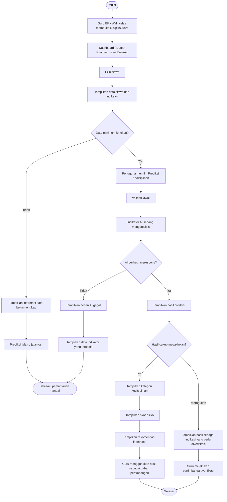

Berikut DRAFT User Flow yang mengikuti SRS dan Use Case DisiplinGuard, dengan fokus pada tiga fungsi AI inti serta **FR-10 daftar prioritas siswa berisiko** sebagai fitur pendukung. Saya tidak menambahkan ambang confidence numerik karena nilainya belum ditentukan dalam sumber.

# DRAFT User Flow DisiplinGuard

## 1. Fokus Alur

**Primary user:** Guru BK / Wali Kelas

**Tujuan alur:** membantu pengguna menemukan siswa yang perlu diperhatikan, menjalankan prediksi kedisiplinan, melihat skor risiko dan rekomendasi intervensi, kemudian menentukan tindak lanjut secara manual.

### Fitur yang dicakup

**Fitur AI ★**

* FR-07: Prediksi tingkat kedisiplinan
* FR-08: Skor risiko
* FR-09: Rekomendasi intervensi

**Fitur pendukung**

* FR-10: Daftar prioritas siswa berisiko

**Input minimum AI**

* Persentase kehadiran
* Jumlah alfa
* Jumlah keterlambatan
* Prestasi akademik atau rata-rata nilai

**Output AI**

* Tingkat kedisiplinan: tinggi, sedang, atau rendah
* Skor risiko
* Rekomendasi intervensi

---

# 2. Alur Pengguna dari Titik Masuk sampai Selesai

### Tahap 1. Membuka daftar prioritas

1. Guru BK atau Wali Kelas masuk ke DisiplinGuard.
2. Sistem menampilkan **dashboard monitoring** atau **daftar prioritas siswa berisiko**.
3. Pengguna melihat daftar siswa yang perlu mendapatkan perhatian.
4. Pengguna memilih salah satu siswa untuk melihat detail.

### Tahap 2. Pemeriksaan data sebelum prediksi

5. Sistem menampilkan data indikator siswa:

   * persentase kehadiran
   * jumlah alfa
   * jumlah keterlambatan
   * prestasi akademik atau rata-rata nilai
6. Pengguna memilih fungsi **Prediksi Kedisiplinan**.
7. Sistem melakukan validasi awal pada data yang akan digunakan.
8. Apabila seluruh data minimum tersedia, proses dapat dilanjutkan.
9. Apabila terdapat data yang belum tersedia, sistem menghentikan proses dan memberi informasi bahwa prediksi belum dapat dilakukan.

### Tahap 3. Pemrosesan AI

10. Pengguna menjalankan prediksi.
11. Sistem menampilkan indikator proses bahwa model AI sedang menganalisis data.
12. Sistem memproses keempat indikator yang tersedia.
13. Target waktu proses adalah **≤ 3 detik [ASUMSI-07]** pada kondisi penggunaan prototype.

### Tahap 4. Penanganan hasil

14. Apabila hasil prediksi berhasil diperoleh, sistem menampilkan:

* kategori kedisiplinan
* skor risiko
* rekomendasi intervensi

15. Pengguna membaca hasil dan menggunakannya sebagai bahan pertimbangan.
16. Hasil AI tidak dianggap sebagai diagnosis pasti.
17. Sistem tidak menetapkan hukuman atau sanksi secara otomatis.

### Tahap 5. Penanganan hasil yang meragukan

18. Apabila sistem menghasilkan hasil dengan tingkat keyakinan yang dianggap belum cukup untuk digunakan secara langsung, sistem menampilkan hasil sebagai **hasil yang memerlukan perhatian atau verifikasi pengguna**.
19. Sistem tidak mengambil keputusan disipliner secara otomatis.
20. Pengguna dapat menggunakan informasi yang tersedia untuk melakukan pemeriksaan atau pertimbangan lebih lanjut.

**Catatan:** SRS tidak menetapkan angka atau ambang batas *confidence* untuk membedakan hasil yakin dan meragukan. Karena itu, threshold numerik **belum ditetapkan** dalam user flow ini.

### Tahap 6. Fallback ketika AI gagal

21. Apabila model AI gagal memberikan respons, sistem menampilkan informasi bahwa prediksi tidak dapat diproses.
22. Sistem tidak menampilkan kategori kedisiplinan yang tidak valid atau hasil prediksi yang dibuat-buat.
23. Data indikator siswa tetap dapat dilihat oleh pengguna.
24. Pengguna dapat melakukan pemantauan berdasarkan informasi yang tersedia dan menentukan tindak lanjut secara manual.

### Tahap 7. Selesai

25. Pengguna telah memperoleh informasi kondisi siswa dan hasil AI apabila proses berhasil.
26. Pengguna menentukan tindak lanjut sesuai pertimbangan profesionalnya.
27. Proses pemantauan siswa selesai.

---

# 3. Diagram User Flow

## 4 Status Sistem yang Harus Terlihat dalam Alur

| Status                        | Kondisi                                                    | Respons Sistem                                                    | Respons Pengguna                                      |
| ----------------------------- | ---------------------------------------------------------- | ----------------------------------------------------------------- | ----------------------------------------------------- |
| **1. Validasi awal**          | Sebelum data diproses AI                                   | Memeriksa ketersediaan 4 input minimum                            | Melengkapi atau memperbaiki data yang diperlukan      |
| **2. AI sedang menganalisis** | Prediksi sedang diproses                                   | Menampilkan indikator proses                                      | Menunggu hasil                                        |
| **3. Hasil tersedia**         | AI berhasil memberikan prediksi                            | Menampilkan kategori, skor risiko, dan rekomendasi                | Membaca dan mempertimbangkan hasil                    |
| **3b. Hasil meragukan**       | Tingkat keyakinan belum memiliki threshold yang ditentukan | Menandai hasil sebagai indikasi yang perlu diverifikasi           | Melakukan pertimbangan lebih lanjut                   |
| **4. Fallback**               | AI gagal merespons                                         | Menampilkan pesan kegagalan dan mempertahankan data yang tersedia | Melakukan pemantauan atau tindak lanjut secara manual |

---

# 5. Alur Ringkas dalam Bentuk Linear

**Masuk sistem**
↓
**Dashboard / Daftar Prioritas Siswa Berisiko**
↓
**Pilih siswa**
↓
**Lihat persentase kehadiran + alfa + keterlambatan + prestasi akademik**
↓
**Validasi data**
↓
**Data lengkap?**

**Tidak** → Informasi data belum lengkap → Pemantauan manual

**Ya** → Jalankan prediksi AI
↓
**AI menganalisis ≤ 3 detik [ASUMSI-07]**
↓
**AI berhasil?**

**Tidak** → Fallback → Data tetap dapat dilihat → Pemantauan manual

**Ya** → Prediksi tersedia
↓
**Hasil cukup meyakinkan?**

**Ya** → Kategori kedisiplinan → Skor risiko → Rekomendasi intervensi → Pertimbangan guru

**Meragukan** → Hasil ditandai perlu verifikasi → Pertimbangan guru
↓
**Selesai**

---

# 6. Kaitan User Flow dengan Use Case

| Tahap Alur                                   | Fitur / Use Case              | Traceability          |
| -------------------------------------------- | ----------------------------- | --------------------- |
| Membuka dashboard                            | Dashboard monitoring          | FR-01                 |
| Melihat daftar siswa berisiko                | Daftar prioritas siswa        | FR-10                 |
| Memilih siswa                                | Data siswa                    | FR-02                 |
| Melihat persentase kehadiran                 | Data absensi                  | FR-03                 |
| Melihat jumlah alfa                          | Data absensi                  | FR-04                 |
| Melihat keterlambatan                        | Data absensi                  | FR-05                 |
| Melihat prestasi akademik                    | Prestasi akademik             | FR-06                 |
| Menjalankan prediksi                         | Prediksi tingkat kedisiplinan | FR-07, NFR-01, NFR-02 |
| Melihat skor risiko                          | Skor risiko                   | FR-08                 |
| Melihat rekomendasi                          | Rekomendasi intervensi        | FR-09, NFR-11         |
| Memproses hasil maksimal 3 detik             | Performance Efficiency        | NFR-03 [ASUMSI-07]    |
| Menggunakan hasil sebagai bahan pertimbangan | Aturan bisnis AI              | BR-07, BR-08          |
| Tidak memberi hukuman otomatis               | Aturan bisnis AI              | BR-09                 |
| Tidak menganggap AI sebagai diagnosis pasti  | Aturan bisnis AI              | BR-10                 |

---

# 7. Prinsip Interaksi yang Harus Dipertahankan

1. **AI membantu, bukan menggantikan guru.** Hasil prediksi harus diposisikan sebagai informasi pendukung keputusan.
2. **Kegagalan AI harus aman.** Sistem tidak boleh mengarang hasil ketika model gagal merespons.
3. **Data harus diperiksa sebelum prediksi.** Prediksi tidak dijalankan ketika input minimum belum tersedia.
4. **Proses harus terlihat oleh pengguna.** Ketika AI sedang memproses, sistem harus memberikan indikator bahwa proses masih berlangsung.
5. **Hasil tidak boleh terlalu absolut.** Terutama karena target akurasi model adalah ≥ 77%, bukan 100%, dan hasil model tidak diposisikan sebagai diagnosis pasti.
6. **Alur utama harus singkat.** Guru yang menangani banyak siswa diarahkan dari daftar prioritas menuju detail siswa dan hasil AI tanpa harus menganalisis seluruh data mentah terlebih dahulu.

**Catatan penting untuk tahap desain berikutnya:** bagian *“hasil yakin vs hasil meragukan”* sudah dimasukkan ke flow, tetapi **threshold confidence belum boleh ditetapkan sebagai angka** karena SRS yang diberikan belum mendefinisikannya. Jadi pada tahap UI maupun implementasi, nilai tersebut sebaiknya tetap ditulis sebagai keputusan yang masih harus ditentukan.
